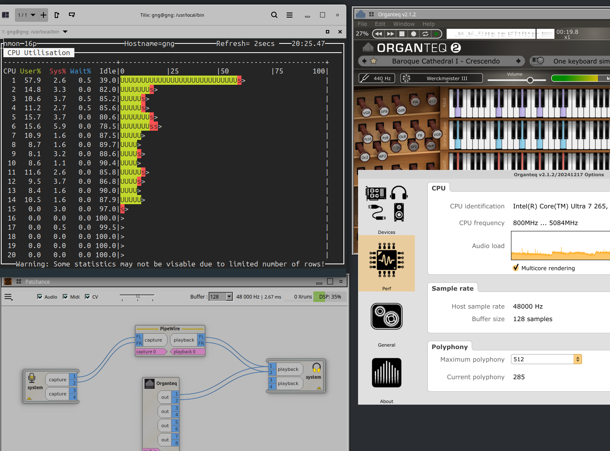

# Hybrid Architecture: udev + systemd

The hybrid system combines **udev rules** with **systemd services** for optimal performance and usability.

## How It Works

```
USB interface connected    →  udev detects device
                           →  systemctl start realtime-audio-optimizer
                           →  Optimizations activated

USB interface removed      →  udev detects removal
                           →  systemctl stop realtime-audio-optimizer
                           →  Optimizations deactivated, system restored
```

## Advantages Over Polling

| Aspect | Polling | Hybrid (Event-driven) |
|--------|---------|----------------------|
| Response Time | 5 seconds | Instant |
| CPU Usage | Permanent | Only with active interface |
| RAM Usage | 1-2MB permanent | 0MB without interface |

## Key Insights

### CPU Governor vs. EPP

- **EPP management** (`powerprofilesctl`) is often **not sufficient** for guaranteed xrun-free operation at low latencies
- **Explicit governor setting** to `performance` remains necessary for professional audio workflows
- The system sets the governor temporarily and restores everything when the interface is removed
- `power-profiles-daemon` runs in the background but only controls EPP, not the governor

### Best Practice

1. Use the hybrid system for audio sessions
2. After the session, everything is automatically restored
3. For everyday use: EPP via `powerprofilesctl` or KDE/Plasma power management

## Monitoring Modes

### Status (Quick Overview)
```bash
realtime-audio-optimizer status
```

### Detailed (Hardware Analysis)
```bash
realtime-audio-optimizer detailed
```

### Live Xrun Monitor (Real-time)
```bash
realtime-audio-optimizer live-xruns

# Output:
# JACK Status: Active
#    Settings: 256@48000Hz, 3 periods (5.3ms latency)
# [15:30:45] Interface: Connected | Session: 12 | 30s: 8
# New xruns: 2
# Recommendation: Increase buffer from 128 to 256 samples
```

### Monitor (Continuous)
```bash
sudo realtime-audio-optimizer monitor
```

## Xrun Evaluation

All modes use identical evaluation logic:

| Xruns | Status | Recommendation |
|-------|--------|----------------|
| 0 | Optimal | Setup running stable |
| 1-4 | Occasional | Increase buffer if needed |
| 5+ | Frequent | Aggressive buffer/sample rate adjustment |

### Contextual Recommendations

- **256 samples + few xruns**: "Increase buffer from 256 to 512"
- **128 samples + many xruns**: "Increase buffer to 1024+ or reduce sample rate"
- **2 periods + problems**: "Use 3 periods instead of 2"
- **>48kHz + xruns**: "Reduce sample rate from 96kHz to 48kHz"

## JACK Detection

The system automatically detects current JACK parameters:

- Buffer size
- Sample rate
- Periods
- Latency

Works even with root execution (systemd) through user context detection.

## Debugging

### Service Status
```bash
sudo journalctl -fu realtime-audio-optimizer
sudo systemctl status realtime-audio-optimizer
```

### udev Events
```bash
sudo udevadm monitor --property --subsystem-match=usb
```

### Manual Tests
```bash
# Manually start/stop service
sudo systemctl start realtime-audio-optimizer
sudo systemctl stop realtime-audio-optimizer

# Direct optimizations
sudo realtime-audio-optimizer once
sudo realtime-audio-optimizer stop
```

## Configuration

### Customize udev Rule
```bash
sudo nano /etc/udev/rules.d/99-realtime-audio-optimizer.rules
sudo udevadm control --reload-rules
sudo udevadm trigger --subsystem-match=usb
```

### Customize Service Parameters
```bash
sudo nano /etc/systemd/system/realtime-audio-optimizer.service
sudo systemctl daemon-reload
```

## Troubleshooting

### Service Doesn't Start Automatically

```bash
# Test udev rule
sudo udevadm test $(udevadm info -q path -n /dev/bus/usb/001/XXX)

# Find USB device
lsusb | grep -i audio
```

### Service Runs Permanently

```bash
# Disable auto-start (hybrid mode)
sudo systemctl disable realtime-audio-optimizer
sudo systemctl stop realtime-audio-optimizer
sudo systemctl is-enabled realtime-audio-optimizer  # Should be "disabled"
```

### Revert to Standard System

```bash
# Enable auto-start
sudo systemctl enable realtime-audio-optimizer
sudo systemctl start realtime-audio-optimizer

# Remove udev rule
sudo rm /etc/udev/rules.d/99-realtime-audio-optimizer.rules
sudo udevadm control --reload-rules
```

## Kernel Isolation for Ultra-Low Latency

The key to achieving ultra-low latency (even 32 samples / 0.7ms!) lies in kernel-level CPU isolation. This ensures the IRQ-handling CPUs are completely free from scheduler interference.

### GRUB Parameters

```bash
# /etc/default/grub
GRUB_CMDLINE_LINUX="isolcpus=14-19 nohz_full=14-19 rcu_nocbs=14-19 threadirqs"

# Apply
sudo update-grub
sudo reboot
```

### Why This Works

| Parameter | Effect | Benefit |
|-----------|--------|---------|
| `isolcpus=14-19` | Isolates CPUs from general scheduler | IRQ CPUs are exclusively reserved |
| `nohz_full=14-19` | Disables timer ticks on isolated CPUs | Zero interruptions from timer |
| `rcu_nocbs=14-19` | Offloads RCU callbacks to other CPUs | No latency spikes from kernel housekeeping |
| `threadirqs` | Enables threaded IRQ handlers | Allows RT priority for IRQ processing |

### The Result

With kernel isolation, even extreme latencies become possible:

- **32 samples @ 48kHz = 0.7ms** latency with Yoshimi – every microsecond counts at these latencies
- **128 samples @ 48kHz = 2.7ms** latency for complex instruments like Organteq with 35+ registers
- IRQ processing is essentially "guaranteed" – no scheduler interference


*Organteq MIDI demo with 35 organ registers – live performance at 128 samples / 48kHz. nmon shows P-Cores under load while E-Cores (CPUs 14-19) remain idle, reserved exclusively for IRQ handling.*

### Without Kernel Isolation

The optimizer still works without these parameters, but:
- IRQ CPUs may occasionally receive other tasks
- Lowest latencies (< 64 samples) become unreliable
- Xruns may occur during CPU-intensive background activity

## FAQ

**Does governor setting damage my system?**
No, as long as everything is cleanly restored after the audio session (automated here).

**Why isn't EPP always sufficient?**
EPP only controls energy preference, not the actual clock strategy. For guaranteed low latency, the `performance` governor remains important.

**Is xrun detection as accurate as external tools?**
Yes, the system detects the same PipeWire-JACK-Tunnel xruns as Patchance/QJackCtl.

**Do JACK recommendations work as root?**
Yes, through user context detection, user JACK sessions are detected even during sudo execution.
