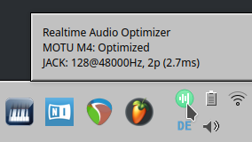
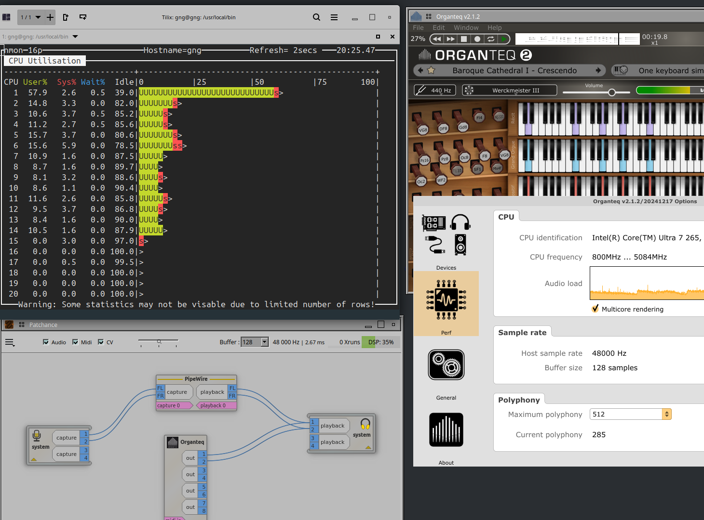

# Realtime Audio Optimizer

A Linux tool for optimizing system performance for professional USB audio interfaces. Works with **any USB Audio Class compliant device** including MOTU, Focusrite, Behringer, PreSonus, and more.

## Features

- **Auto-Detection**: Automatically detects all connected USB audio interfaces
- **CPU Optimization**: Intelligent CPU governor management for P-Cores and E-Cores
- **Process Affinity**: Pins audio processes (JACK, PipeWire, DAWs) to optimal CPU cores
- **IRQ Optimization**: Dedicates CPU cores for USB and audio interrupt handling
- **USB Power Management**: Disables autosuspend to prevent audio dropouts
- **Kernel Tuning**: Optimizes scheduler parameters for low-latency audio
- **Real-time Priorities**: Sets SCHED_FIFO priorities for audio processes
- **Live Monitoring**: Real-time xrun monitoring and performance statistics
- **System Tray**: Optional status indicator with PyQt5 or yad

## Supported Audio Interfaces

Works with any USB Audio Class 1.0/2.0 compliant device, including:

- MOTU (M4, M2, UltraLite, etc.)
- Focusrite (Scarlett series, Clarett, etc.)
- Behringer (UMC series, U-PHORIA, etc.)
- Steinberg (UR series, etc.)
- PreSonus (Studio series, AudioBox, etc.)
- Universal Audio (Volt series)
- Audient, Native Instruments, RME, and more

## Requirements

- Linux with ALSA sound support
- Root privileges for system optimizations
- Optional: python3-pyqt5 for system tray

## Installation

```bash
git clone https://github.com/giang17/realtime-audio-optimizer.git
cd realtime-audio-optimizer
sudo ./install.sh install
```

## Usage

### Command Line

```bash
# Show detected audio interfaces
realtime-audio-optimizer detect

# One-time optimization
sudo realtime-audio-optimizer once

# Continuous monitoring (daemon mode)
sudo realtime-audio-optimizer monitor

# Show status
realtime-audio-optimizer status

# Detailed hardware info
realtime-audio-optimizer detailed

# Live xrun monitoring
realtime-audio-optimizer live-xruns

# Read-only diagnosis (no changes)
realtime-audio-optimizer check

# Deactivate optimizations
sudo realtime-audio-optimizer stop
```

### Diagnosis (`check`)

The `check` command inspects the running system and reports what is correctly
configured and what is not — **without making any changes**. It checks:

- Kernel boot parameters (`threadirqs`, `nohz_full`, `isolcpus`)
- `irqbalance` state and RT-CPU exclusions
- Whether audio IRQ threads run with RT priority (SCHED_FIFO)
- CPU governors for P-Cores / E-Cores / IRQ cores
- USB autosuspend for connected audio devices
- Whether the current user is in the `audio` or `realtime` group
- IRQ sharing conflicts between audio and video devices

```bash
realtime-audio-optimizer check
```

For every ❌ finding, a short fix hint is printed (e.g. *"Run: sudo
realtime-audio-optimizer once"* or *"Add 'threadirqs' to your kernel command
line"*). The exit code is `0` if everything passes and `1` if at least one
check fails, so it can be used in scripts or CI.

### Sleep / Wake

After `suspend` / `hibernate` the kernel resets IRQ affinity, CPU governors
and RT priorities. The installer registers a systemd sleep hook at
`/usr/lib/systemd/system-sleep/realtime-audio-optimizer` that re-applies the
optimizations automatically after every wake-up (using `once-delayed`, so it
waits for PipeWire / JACK to come back before retuning).

No configuration is needed — the hook is installed and uninstalled together
with the optimizer. To verify it is in place:

```bash
ls -l /usr/lib/systemd/system-sleep/realtime-audio-optimizer
```

### Automatic Mode

The optimizer automatically activates when a USB audio interface is connected via udev rules.

### System Tray

```bash
rt-audio-tray
```


*Tooltip shows interface name, optimization status, and JACK latency info*

## CPU Strategy (Intel 12th/13th/14th Gen Hybrid)

The optimizer uses a hybrid strategy optimized for Intel Alder Lake / Raptor Lake / Arrow Lake CPUs:


*Organteq MIDI demo with 35 organ registers – live performance at 128 samples / 48kHz. nmon shows P-Cores under load while E-Cores remain idle for IRQ handling.*

| CPU Range | Type | Governor | Purpose |
|-----------|------|----------|---------|
| 0-5 | P-Cores | Performance | DAWs, Plugins |
| 6-7 | P-Cores | Performance | JACK/PipeWire |
| 8-13 | E-Cores | Powersave | Background tasks |
| 14-19 | E-Cores | Performance | IRQ handling |

Adjust CPU ranges in `/etc/realtime-audio-optimizer.conf` for different CPU configurations.

### Dynamic IRQ detection

Starting with this release the optimizer detects the *actual* CPU topology
of the running system at runtime (using `core_type` from intel-pstate on
hybrid CPUs, or the last quarter of online CPUs on non-hybrid systems) and
picks the best CPU range for IRQ handling automatically. If detection
fails, the static `IRQ_CPUS` value from the configuration file is used as a
safe fallback. To force the legacy static behaviour, set
`RT_AUDIO_DYNAMIC_IRQS=false` in `/etc/realtime-audio-optimizer.conf`.

### Required: Kernel Boot Parameters

For optimal IRQ handling, the IRQ CPUs (14-19) must be isolated from the kernel scheduler. Add these parameters to your GRUB configuration:

```bash
# Edit GRUB config
sudo nano /etc/default/grub

# Add or modify this line:
GRUB_CMDLINE_LINUX="isolcpus=14-19 nohz_full=14-19 rcu_nocbs=14-19 threadirqs"

# Apply changes
sudo update-grub
sudo reboot
```

**Parameter explanation:**
- `isolcpus=14-19` - Isolates these CPUs from the general scheduler (reserved for IRQs)
- `nohz_full=14-19` - Disables timer ticks on these CPUs when idle (reduces latency)
- `rcu_nocbs=14-19` - Offloads RCU callbacks from these CPUs (prevents latency spikes)
- `threadirqs` - Enables threaded IRQ handlers (allows RT priority assignment)

> **Note:** Adjust the CPU range (14-19) to match your `IRQ_CPUS` configuration. Without these parameters, the optimizer will still work but cannot achieve the lowest possible latency.

## Configuration

Copy the example config and customize:

```bash
sudo cp /etc/realtime-audio-optimizer.conf.example /etc/realtime-audio-optimizer.conf
sudo nano /etc/realtime-audio-optimizer.conf
```

### Key Configuration Options

```bash
# CPU assignments (adjust for your CPU)
IRQ_CPUS="14-19"
AUDIO_MAIN_CPUS="6-7"
DAW_CPUS="0-5"
BACKGROUND_CPUS="8-13"
ALL_CPUS="0-19"

# RT priority levels
RT_PRIORITY_JACK=99
RT_PRIORITY_PIPEWIRE=85
RT_PRIORITY_AUDIO=70

# Additional audio processes to optimize
EXTRA_AUDIO_PROCESSES="my-custom-daw my-synth"

# Enable system tray updates
TRAY_ENABLED="true"
```

## Troubleshooting

### Check detected interfaces
```bash
realtime-audio-optimizer detect
```

### View logs
```bash
# System log
journalctl -u realtime-audio-optimizer.service

# Application log
cat /var/log/realtime-audio-optimizer.log
```

### Manual service control
```bash
sudo systemctl status realtime-audio-optimizer
sudo systemctl start realtime-audio-optimizer
sudo systemctl stop realtime-audio-optimizer
```

## Uninstallation

```bash
sudo ./install.sh uninstall
```

## Releases

For release notes with download links, see [GitHub Releases](https://github.com/giang17/realtime-audio-optimizer/releases).

## Credits

Based on [MOTU M4 Dynamic Optimizer](https://github.com/giang17/motu-m4-dynamic-optimizer).

## License

This project is licensed under the MIT License — see [LICENSE](LICENSE) for details.
